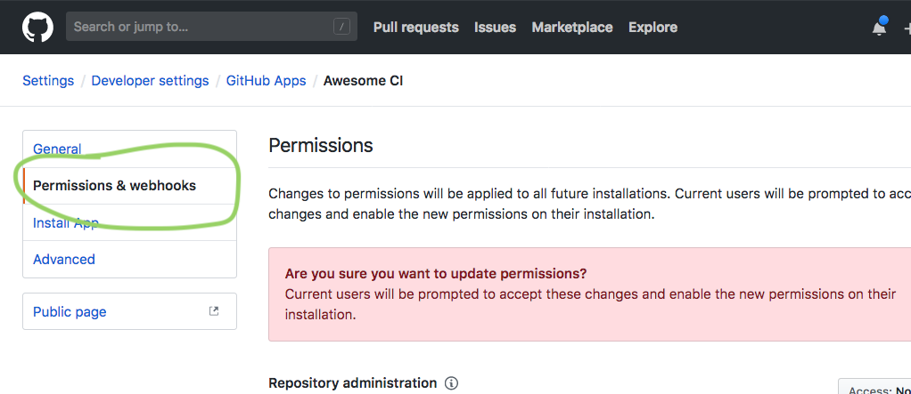

# Building a CI server

{:toc}

_Continuous Integration_ (or "CI") is a team software development practice in which contributions to the team code are merged together ("integrated") at frequent intervals, to keep every developer's copy of the codebase in sync with each others, and to make sure that what everyone is working on is jointly harmonious.

While Git and {{ site.data.variables.product.product_name }} are ideal tools for merging code from multiple authors, a CI server is a tool that helps check the all code contributions work together harmoniously. Depending on the nature of the project, this might include running test suites, performing security checks, ensuring that the code builds, or even deploying to staging or production servers.

The [Checks API][checks API] lets your CI servers receive triggers from {{ site.data.variables.product.product_name }} that code is ready for testing (for example, when a pull request is [`opened`](https://developer.github.com/v3/activity/events/types/#pullrequestevent) or `synchronized`), and gives your CI server the ability to give detailed status reports directly back to the developers in the {{ site.data.variables.product.product_name }} interface.

In this guide, we'll learn how to use the Checks API by building out the framework for a CI server  that you can use in your development process. We'll learn:

* What is a **check run**?
* What is a **check suite**?
* How can we use these tools to create rich and helpful status reports in {{ site.data.variables.product.product_name }}?

At the end of the guide, we'll have the framework for a CI server that will:

* Listen for requests to run a test suite, for example when a Pull Request is opened
* Inform  when a new run has begun
* Update {{ site.data.variables.product.product_name }} with a detailed report when the run has complete.

This guide builds upon the {{ site.data.variables.product.product_name }} App boilerplate code that is featured in [Building Your First {{ site.data.variables.product.product_name }} App][my first app]. If you haven't yet run through that guide, or you aren't sure where to begin building a {{ site.data.variables.product.product_name }} App, we recommend that you read through that one first.

(TODO the above paragraph should be a re-usable snippet)

Note: you can download the complete source code for this project from [the platform-samples repo][platform samples].

## First steps: App permissions

We're going to pick up immediately where the [Building your first {{ site.data.variables.product.product_name }} App][my first app] guide left off. We assume that you have the [boilerplate code][app boilerplate] running and ready to go, that you have [ngrok][ngrok] running and pointed at your app, and your app [registered with {{ site.data.variables.product.product_name }}][app settings]. If you don't, please feel free to go back and review the [Building your first {{ site.data.variables.product.product_name }} App][app boilerplate] guide.

Now that we want to leverage specific features available to GitHub apps, we need to update our app's permissions. That is, we need to instruct GitHub that our app requires access to particular things in the repositories where it is installed. Visit [your app's settings page][app settings] and click **Permissions & webhooks**



To use the Checks API, scroll to the bottom of this page, and select the **Read & write** access level for Checks permissions.


Then, just below, add event subscriptions for **Check suites** and **Check runs**


Then click **Save changes**

### Installation settings

What happens next depends on whether you have already installed your app into your account.

1. You have probably installed your app on a repository already. If so, you'll need to tell GitHub that you (as the app _installer_) accept these new permissions. Visit [the app installations settings page][installation settings], click on **Configure** next to your app's name.
 
At the top, you'll see that your app's permissions have changed (because we just updated them!). Click **Details**.
 

2. If you _haven't_ yet installed your sample app, you'll need to do that now. Choose a repository, or create a new, empty repository. Return to the [app settings page][app settings], click on the name of your app, and then **Install App** on the left. Then follow the prompts to select an organization and repository.


In either case, you'll be prompted to allow your app access to some or all of your repositories. This is of course necessary so that our app can inspect our code. We recommend that you set up an empty sandbox repository set up to play around in, and limit your app to that repository.


## How will the Checks API help us?

OK, so now we've got all the permissions necessary lined up! Enough prep work, let's get down to nuts and bolts.

Imagine: You're working on a project with other engineers. You're ready to check in some of your code, so you open a pull request on {{ site.data.variables.product.product_name }}.

What happens now is that {{ site.data.variables.product.product_name }} notices that this is an opportune moment to involve the CI server. In the nomenclature of the Checks API, a **Check Run** is an action that an external service can provide by inspecting your code in some way, and deciding whether your code _passes_ or _fails_ some test. A simple example is an integration test suite: A test suite _checks_ your code to see if it breaks any of the tests, then indicates whether all the tests pass, or at least one test fails. But that's just one example. 

Anyway, when you create your pull request, {{ site.data.variables.product.product_name }} creates a **Check Suite**. A Check Suite is a (for the moment empty) collection of check runs. {{ site.data.variables.product.product_name }} then notifies all apps installed for that repository that are listening that a new Check Suite has been created.

At this stage, the notified apps are given the chance to add one or more _Check Runs_ to the Check Suite. A Check Run represents one check—it might be an entire entire test suite, or it might be an individual test (to continue the integration testing example).

Each Check Run can have one of three statuses: **queued** (the default), **running**, or **complete**. In turn, each status can have additional detail. For example, a **complete** Check Run might be marked as **passing** or **failing**.

Each app is free to update the status of each Check Run it creates asyncronously, or even add more Check Runs if needed. But once each Check Run is marked as complete, {{ site.data.variables.product.product_name }} will mark the entire Check Suite as complete, closing the loop.


## Receiving Checks API events

Great, so we know now that checks are kicked off by the creation of a [Check Suite event](https://developer.github.com/v3/activity/events/types/#checksuiteevent). Let's update our boilerplate code to handle `check_suite` events. Open _`server.rb`_, and find the events handler.

``` ruby
########## Events
#
# This is the webhook endpoint that GH will call with events, and hence where we will do our event handling
#

  post '/event_handler' do
    # First, a bit of security
    check_signature!

    # Determine what kind of event this is, and take action as appropriate
    event = request.env['HTTP_X_GITHUB_EVENT']
    action = @payload['action'] || nil

    case event
      when :check_suite
          # A new check_suite has been created or rerequested. Create a new check_run with status "running"
          if payload['action'] == :requested || @payload['action'] == :rerequested
            create_check_run
          end
    
        'ok'  # we have to return _something_ ;)
      end

```

What's going on? Every event that {{ site.data.variables.product.product_name }} sends out includes a request header called `HTTP_X_GITHUB_EVENT` HTTP header. This header encodes the event type. Right now, we're only interested in events of type `check_suite`, which will be emitted when a new Check Suite is created.

Each event has an additional `action` field that indicates what's going on. For `check_suite`, this field can take one of the following values: `requested`, `rerequested`, `completed`. We care about the first two: They indicate that either a new `check_suite` has been created, or an existing one is being re-run.

Once we have identified whether the received event is a new (or re-run) `check_suite`, we take action by calling `create_check_run`, a helper method to actually kick off our CI's test suite. Let's write that method now.

## Creating a Check Run

The `create_check_run` method will request a new Check Run object from {{ site.data.variables.product.product_name }}. Normally, having done that, we would at this point kick off the actual CI process, but that's for you to add later!

``` ruby
########## Helpers
#
# These functions are going to help us do some tasks that we don't want clogging up the happy paths above, or
# that need to be done repeatedly. You can add anything you like here, really!
#

  helpers do

    # Create a new Check Run
    def create_check_run
      # First, we need to exchange our JWT for an installation token against the repository
      # that triggered this check suite. This is an important bit of authentication
      token = get_installation_token
      installation_client = Octokit::Client.new(bearer_token: token)

      # Octokit doesn't yet support the Checks API, but it does provide generic HTTP methods we can use!
      # https://developer.github.com/v3/checks/runs/#create-a-check-run
      result = installation_client.post("#{@payload['repository']['url']}/check-runs", {
          accept: 'application/vnd.github.antiope-preview+json', # This header allows for beta access to Checks API
          name: 'Awesome CI',
          # The information we need should probably be pulled from persistent storage, but we can
          # use the event that triggered the run creation. However, the structure differs depending on whether
          # it was a check run or a check suite event that trigged this call.
          head_branch: @payload['check_suite'].nil? ? @payload['check_run']['check_suite']['head_branch'] : @payload['check_suite']['head_branch'],
          head_sha: @payload['check_suite'].nil? ? @payload['check_run']['head_sha'] : @payload['check_suite']['head_sha']
      })

      # We've now requested the creation of a check run from GitHub. We will wait until we get a confirmation
      # from GitHub, and then kick off our CI process from there.

      result.attrs
    end
```

The function does three things in turn.

1) It requests an [installation access token](https://developer.github.com/apps/building-github-apps/authenticating-with-github-apps/#authenticating-as-an-installation). This token is a special API token with a limited lifetime that can only be used to make API requests against a specific repository, in this case the repository with the new Check Suite. We need this token in order to create a Check Run.

2) It `POST`s to the [`checks-runs`](https://developer.github.com/v3/checks/runs/#create-a-check-run) endpoint to create a new Check Run. This endpoint has several required fields, and a few optional.
    * We have to give the Check Run a useful and descriptive name
    * We have to indicate which branch the check run is operating on—we get this from the `check_suite` event, but really it could be any branch.
    * We have to indicate the specific commit on that branch. Again, we get this from the `check_suite` event.
    * We need to indicate a status. If this field is omitted, it is assumed to be `queued`, but it can also be `in_progress` (what we indicate), or `completed`.

    We could also provide more details about what we are up to. We could provide a set of actions for the user to follow up with. We could provide a URL for the user to follow to learn more about the run.
    
    You can read more about the options on the [Run Check creation reference page][create a run check].
    
3) Then, normally, after all this, you would kick off the actual CI run. We _don't_ do that here. 
 
To test out this proof-of-concept, first run the server from your terminal by entering

``` bash
ruby server.rb
```

If it doesn't start, don't forget to set the necessary environment variables as per the [Building Your First App guide][my first app]!

And then open a pull request in one of the repositories where you have installed our app. Your server should respond accordingly by creating a check run on your pull request. It will look like this:


Great! At this point we can create a Check Run. Let's now update it's status to indicate when it has been completed.

## Updating Check Runs

Now, we imagine that our CI server has completed its test suite, and needs to update the Check Run to indicate success or failure. For our purposes, we aren't actually going to fire off a test suite. Instead we are going to borrow some other trigger, just for demonstration purposes. {{ site.data.variables.product.product_name }} not only notifies us of `check_suite` events, but also `check_run` events. These events are fired off when a new `check_run` is created, or completed. We can just wait for our own Check Run to result in such an event, and then we will update it's status to complete. 

First, let's update the event handler code to watch for `check_run` events:

``` ruby
########## Events
#
# This is the webhook endpoint that GH will call with events, and hence where we will do our event handling
#

  post '/event_handler' do
    
    ...

    case event
    
    ...
    
    when :check_run
      # GH confirms our new check_run has been created, or rerequested. Update it to "completed"
      case action
      when :created
        # Notice that we get notifications of the check runs created by _other_ systems than ours!
        # We need to be selective, hence the conditional on the app id. We only want to process our _own_
        # check runs. That's why we check if the app id is == APP_IDENTIFIER
        initiate_check_run if @payload['check_run']['app']['id'] == APP_IDENTIFIER
      when :rerequested
        # initiate_check_run
        create_check_run if @payload['check_run']['app']['id'] == APP_IDENTIFIER
      end
    end
```

Again, we're watching for `check_run` events with an action of `created` or `rerequested` so we can capture both new Check Runs, and requests for an existing Check Run be re-run. In either case, we need to be sure that the check run events correspond to check runs that _we_ created. If multiple apps are creating check runs, each app will receive events for _all_ check runs, even those it didn't create. So we are filtering the events based on whether they were generated by _us_.

We're capturing two different contexts here. First, when a new check run has been `created`, that's our signal that GitHub has heard our request to create a check run, and we can begin the CI process. In this case, we call a helper function called `initiate_check_run`, we we'll look at in more detail just below.

Second, when someone requests that we re-run a check run, that's our signal that we should create a new check run, to start the whole process over. In this case we'll call the `create_check_run` method we defined earlier.

TODO: Why is the API such that we can't update an existing check run? Why do we have to create a new one? This is feedback for the API team. Bex thoguhts: So that there's an existing history and consistency across checks.

Now, let's write the helper function that will do the updating

``` ruby
# Start the CI process
    def initiate_check_run
      token = get_installation_token
      installation_client = Octokit::Client.new(bearer_token: token)

      # This method is called in response to GitHub acknowledging our request to create a check run.
      # We'll first update the check run to "in progress"
      # Then we'll run our CI process
      # Then we'll update the check run to "completed" with the CI results.

      # Octokit doesn't yet support the Checks API, but it does provide generic HTTP methods we can use!
      # https://developer.github.com/v3/checks/runs/#update-a-check-run
      # notice the verb! PATCH!
      result = installation_client.patch(@payload['check_run']['url'], {
          accept: 'application/vnd.github.antiope-preview+json', # This header is necessary for beta access to Checks API
          name: 'Awesome CI',
          status: :in_progress
      })

      # ***** DO IT! *****
      # This is where we would kick off our CI process. Ideally this would be performed async, so we could
      # return immediately. But for now we'll do a simulated CI process syncronously, and update the check run right here..

      # Was this a success?
      result = :success # could also be :failure

      opts = {
          accept: 'application/vnd.github.antiope-preview+json', # This header is necessary for beta access to Checks API
          name: 'Awesome CI',
          status: :completed,
          conclusion: result,
          completed_at: Time.now.utc.iso8601
      }

      # Now, mark the check run as complete! And if there are warnings, share them
      result = installation_client.patch(@payload['check_run']['url'], opts)

      result.attrs
    end
```


This method is doing three things:

1) It requests an installation access token, just like before.

2) It kicks off the CI process. In fact, in the sample code we are working with, nothing happens, so it's up to you to decide how this will work! For now, we just pretend the CI process succeeded, and all tests passed.

3) Finally, we `PATCH`s the `checks-runs` endpoint to update our check run with the CI results. In this case, we want to indicate success. We get the particular endpoint to call from the `check_run` event, which is super handy. This endpoint has several required fields, and a few optional.
    * We have to give the Check Run a useful and descriptive name
    * We may change the status of the Check Run, which we do. We update it to `completed`, but we could change it to `queued` or `in_progress`.
    * Because we have indicated the Check Run is completed, we have to indicate the outcome of the check. We can choose `success`, `failure`, `neutral`, `cancelled`, `timed_out`, or `action_required`, and here we indicate `success` for our example.
    * Because we have indicated the Check Run is completed, we also have to provide a timestamp for when it was completed.
    
    We could also provide more details about what our check is doing. We could provide a set of actions for the user to follow up with. We could provide a URL for the user to follow to learn more about the run. We can provide a list of which tests failed, and even links to the specific lines of code that caused the failures!
    
    You can read more about the options on the [Run Check update reference page][update a run check].

And that's it! Test out the new code by re-running the server, and clicking **re-run** on the pull request checks page. If everything is working, you'll see the Check Run update to success!


## Going Further

Check suites and runs are powerful entities, and you can do a lot more with them than we have here in this demo. For example, on failing runs, you can indicate files and line numbers to pinpoint the exact cause of the failure, You can also provide useful commentary on why a check run passed or failed, for example the total run time, memory consumption, or the results of upstream operations. Read more about how to use these features in the [Checks API documentation][checks API].

You can download the final source code for this guide from the [platform samples repository][platform samples]. 

We're excited to see what you build! Feel free to share your creations and your success with us TODO HOW!?


[checks API]: /v3/checks
[app boilerplate]: https://github.com/github/platform-samples/tree/master/apps/ruby/building-a-ci-server
[my first app]: /apps/guides/TODO
[ngrok]: https://ngrok.com/
[app settings]: https://github.com/settings/apps
[installation settings]: https://github.com/settings/installations
[create a check run]: /v3/checks/runs/#create-a-check-run
[update a check run]: /v3/checks/runs/#update-a-check-run
[platform samples]: https://github.com/github/platform-samples/tree/master/app/ruby/building-a-ci-server
